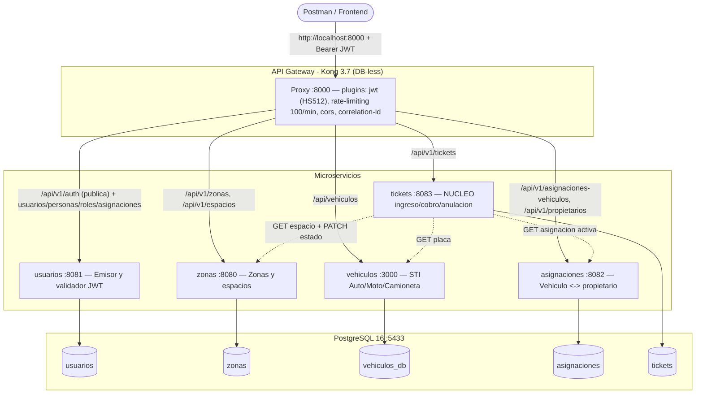
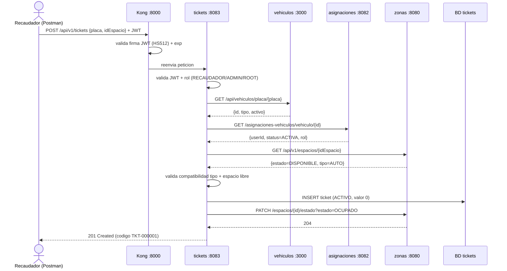

# Sistema de Gestión de Parqueaderos — Guía completa y pruebas en Postman

> Arquitectura de microservicios con API Gateway (Kong), base de datos PostgreSQL
> unificada y autenticación JWT centralizada. Este documento explica **cómo
> funciona**, **cómo levantarlo** y **cómo probarlo paso a paso en Postman**.

---

## 1. Visión general

El sistema simula la operación de un parqueadero. Está compuesto por **5
microservicios** independientes, un **API Gateway** que unifica el acceso y una
sola instancia de **PostgreSQL** (una base de datos por servicio).

| Microservicio  | Puerto | Tecnología            | Base de datos   | Rol en el sistema |
|----------------|--------|-----------------------|-----------------|-------------------|
| `usuarios`     | 8081   | Spring Boot / Java 25 | `usuarios`      | Emite y valida JWT. Autoridad de personas, usuarios y roles. |
| `zonas`        | 8080   | Spring Boot / Java 25 | `zonas`         | Zonas físicas y espacios (plazas) del parqueadero. |
| `vehiculos`    | 3000   | NestJS + TypeORM      | `vehiculos_db`  | Catálogo de vehículos (herencia: Auto / Motocicleta / Camioneta). |
| `asignaciones` | 8082   | Spring Boot / Java 25 | `asignaciones`  | Relación vehículo ↔ propietario y trazabilidad. |
| `tickets`      | 8083   | Spring Boot / Java 25 | `tickets`       | **Núcleo**: ingreso, cobro y anulación. Orquesta a los demás. |
| `Kong`         | 8000 (proxy) / 8001 (admin) | Kong 3.7 DB-less | — | Puerta de entrada única. Valida JWT, rate-limiting, CORS. |
| `PostgreSQL`   | 5433   | Postgres 16           | (contenedor `parqueadero-postgres`) | Persistencia. |

---

## 2. Diagrama de arquitectura



---

## 3. Autenticación y autorización (JWT)

- **`usuarios` es el emisor del token.** En el login devuelve un JWT firmado con
  **HS512**, con `iss = parqueadero` y el claim `sub = id del usuario` y `roles`.
- **Kong valida la firma y la expiración** de cada token antes de dejar pasar la
  petición (plugin `jwt`). El secreto y el algoritmo deben coincidir con los de
  `usuarios` (por eso en `kong.yml` el consumidor usa `key: parqueadero`,
  `algorithm: HS512`).
- **El control fino por rol lo hace cada microservicio.** Por ejemplo, `tickets`
  exige rol `RECAUDADOR`, `ADMIN` o `ROOT` para operar (vía `@PreAuthorize`).

### Rutas públicas vs protegidas
| Ruta                         | ¿Requiere token? |
|------------------------------|------------------|
| `/api/v1/auth/**` (login, register) | ❌ No (pública) |
| Todo lo demás                | ✅ Sí (Bearer JWT) |

### Credenciales de arranque (bootstrap)
- Usuario administrador: **`root` / `Root2025`** (DNI `0000000000`, rol `ROOT`).
- Roles sembrados: `ROOT`, `ADMIN`, `RECAUDADOR`, `CLIENTE`, `INVITADO`.

---

## 4. Flujo del núcleo: ingreso de un ticket

El microservicio `tickets` **orquesta** a los demás. Un ingreso encadena varias
llamadas y solo tiene éxito si **todas** las validaciones pasan.



### Reglas de negocio clave
- **Ingreso solo por placa.** El vehículo debe existir, estar **activo** y tener
  una **asignación ACTIVA**.
- **Compatibilidad estricta de tipo:** `Auto → AUTO`, `Motocicleta → MOTO`,
  `Camioneta → BUSETA`.
- **Un vehículo no puede tener dos tickets activos**; un espacio tampoco.
- **Tarifa por hora**, fracción redondeada hacia arriba, mínimo 1 hora.
- **Anulación:** solo tickets **ACTIVOS** (corrige errores humanos, sin cobro).
  Un ticket **PAGADO no se anula**.
- **Consistencia:** el ticket se guarda y, como último paso, se ocupa el espacio
  (PATCH). Si el PATCH falla, la transacción revierte el ticket.

---

## 5. Cómo levantar todo el stack

Desde la raíz del proyecto (`primeraClase/`).

### 5.1 Base de datos (PostgreSQL en Docker)
```bash
docker compose up -d          # levanta parqueadero-postgres en el puerto 5433
```

### 5.2 Microservicios
> Java necesita `JAVA_HOME` apuntando a JDK 25.

```bash
export JAVA_HOME=/usr/lib/jvm/java-25-openjdk

# usuarios (8081)
./usuarios/mvnw -f usuarios/pom.xml spring-boot:run

# zonas (8080)
./zonas/mvnw -f zonas/pom.xml spring-boot:run

# asignaciones (8082)
./asignaciones/mvnw -f asignaciones/pom.xml spring-boot:run

# tickets (8083)
./tickets/mvnw -f tickets/pom.xml spring-boot:run

# vehiculos (3000) — NestJS
cd vehiculos/vehiculos && npm install && npm run build && node dist/main
```

### 5.3 API Gateway (Kong)
```bash
cd gateway && docker compose up -d      # proxy en 8000, admin en 8001
```

### 5.4 Verificar que todo responde
```bash
curl -s -o /dev/null -w "usuarios %{http_code}\n"     http://localhost:8081/api/v1/usuarios   # 401 (vivo, pide token)
curl -s -o /dev/null -w "zonas %{http_code}\n"        http://localhost:8080/api/v1/zonas
curl -s -o /dev/null -w "vehiculos %{http_code}\n"    http://localhost:3000/api/vehiculos
curl -s -o /dev/null -w "asignaciones %{http_code}\n" http://localhost:8082/api/v1/asignaciones-vehiculos
curl -s -o /dev/null -w "tickets %{http_code}\n"      http://localhost:8083/api/v1/tickets
curl -s -o /dev/null -w "kong %{http_code}\n"         http://localhost:8000/api/v1/tickets
```

---

## 6. Pruebas manuales en Postman

### 6.1 Importar
1. Importa la **colección**: `postman/Gestion_Parqueaderos.postman_collection.json`.
2. Importa el **environment**: `postman/Parqueadero-Kong.postman_environment.json`.
3. En la esquina superior derecha de Postman, **selecciona el environment
   "Parqueadero - Kong"**.

Todas las peticiones apuntan al gateway `http://localhost:8000` (variables
`{{urlUsuarios}}`, `{{urlTickets}}`, etc.). Para vehículos el prefijo es
`{{urlVehiculos}} = http://localhost:8000/api`.

### 6.2 Cómo funcionan las variables (¡importante!)
La colección **guarda automáticamente** en el environment los datos que va
creando: `token`, `idPersona`, `idUsuario`, `idRol`, `idZona`, `idEspacio`,
`placa`, `idAsignacion`, `idTicket`, `tokenCliente`, `tokenRecaudador`, etc.

👉 **Por eso el orden importa.** Ejecuta las carpetas **de arriba hacia abajo**.
Cada petición usa lo que guardó la anterior. Si ejecutas una petición suelta sin
sus prerequisitos, verás errores 401/404 por variables vacías.

> **Recomendación rápida:** usa el **Collection Runner** (botón *Run* sobre la
> colección) para ejecutar todo en orden y ver el resumen verde. Para entender
> cada paso, hazlo manual como se describe abajo.

### 6.3 Recomendación antes de empezar (BD limpia)
Para una corrida reproducible, limpia las tablas (se conserva `root` y los roles
sembrados):
```bash
docker exec parqueadero-postgres psql -U postgres -d usuarios -c "DELETE FROM user_role WHERE id_user IN (SELECT id_person FROM users WHERE username<>'root'); DELETE FROM users WHERE username<>'root'; DELETE FROM persons WHERE dni<>'0000000000'; DELETE FROM roles WHERE name NOT IN ('ROOT','ADMIN','RECAUDADOR','CLIENTE','INVITADO');"
docker exec parqueadero-postgres psql -U postgres -d zonas         -c "TRUNCATE zonas, espacios CASCADE;"
docker exec parqueadero-postgres psql -U postgres -d vehiculos_db  -c "TRUNCATE vehiculo CASCADE;"
docker exec parqueadero-postgres psql -U postgres -d asignaciones  -c "TRUNCATE vehicle_assignments, assignment_audit_events CASCADE;"
docker exec parqueadero-postgres psql -U postgres -d tickets       -c "TRUNCATE tickets CASCADE;"
```

---

## 7. Recorrido paso a paso (carpeta por carpeta)

Ejecuta en este orden. Cada fila indica la petición, el método y el **código
esperado**. Los ✅ son casos felices; los ⛔ son validaciones/errores esperados
(¡también deben cumplirse!).

### 📁 Auth (JWT) — empieza aquí
| # | Petición | Método | Esperado | Qué prueba |
|---|----------|--------|----------|------------|
| 1 | Login root (admin) | POST | ✅ 200 | Guarda `token` (ROOT). **Sin esto nada más funciona.** |
| 2 | Crear persona (para registro público) | POST | ✅ 201 | Persona base para registrar un cliente. |
| 3 | Registro cliente (rol CLIENTE) | POST | ✅ 201 | Alta self-service con rol CLIENTE. |
| 4 | Login cliente | POST | ✅ 200 | Guarda `tokenCliente`. |
| 5 | Mis datos (/me) | GET | ✅ 200 | El token identifica al usuario. |
| 6 | Acceso sin token (401) | GET | ⛔ 401 | Ruta protegida rechaza sin JWT. |
| 7 | Refrescar token | POST | ✅ 200 | Renueva el JWT. |

### 📁 Persona
| Petición | Método | Esperado |
|----------|--------|----------|
| Crear persona | POST | ✅ 201 |
| Listar personas | GET | ✅ 200 |
| Obtener persona por ID | GET | ✅ 200 |
| Buscar por DNI | GET | ✅ 200 |
| Buscar por apellido | GET | ✅ 200 |
| Actualizar persona | PUT | ✅ 200 |
| Desactivar persona (cascada a usuario) | PATCH | ✅ 200 |
| Activar persona | PATCH | ✅ 200 |

### 📁 Roles
| Petición | Método | Esperado |
|----------|--------|----------|
| Crear rol | POST | ✅ 201 |
| Crear rol alterno no asignado | POST | ✅ 201 |
| Listar roles / Obtener por ID | GET | ✅ 200 |
| Actualizar rol | PUT | ✅ 200 |
| **Crear rol (nombre inválido → 400)** | POST | ⛔ 400 |
| Desactivar rol / Activar rol | PATCH | ✅ 200 |

### 📁 Usuarios (incluye subcarpeta Asignaciones)
| Petición | Método | Esperado |
|----------|--------|----------|
| Crear / Listar / Obtener / Buscar por username | POST/GET | ✅ 201 / 200 |
| Actualizar usuario | PUT | ✅ 200 |
| Desactivar / Activar usuario | PATCH | ✅ 200 |
| **Asignaciones** → Asignar rol a usuario | POST | ✅ 201 |
| Listar asignaciones / Roles de un usuario | GET | ✅ 200 |
| Desactivar / Activar asignación (quitar/devolver rol) | PATCH | ✅ 200 |

### 📁 Zonas
| Petición | Método | Esperado |
|----------|--------|----------|
| Crear zona | POST | ✅ 201 (guarda `idZona`) |
| Listar / Obtener por ID | GET | ✅ 200 |
| Actualizar zona | PUT | ✅ 200 |
| Desactivar zona (cascada) / Activar zona | PATCH | ✅ 200 |

### 📁 Espacios
> Al final, esta carpeta deja **un espacio DISPONIBLE y activo** listo para Tickets.

| Petición | Método | Esperado | Nota |
|----------|--------|----------|------|
| Crear espacio | POST | ✅ 201 | Guarda `idEspacio`. Tipo `AUTO`. |
| Listar / Obtener por ID | GET | ✅ 200 | |
| Actualizar espacio | PUT | ✅ 200 | |
| Cambiar estado (OCUPADO) | PATCH | ✅ 200 | Estado por *query param* `?estado=`. |
| Espacios disponibles / por estado / por zona y estado | GET | ✅ 200 | Consultas filtradas. |
| Disponibilidad de un espacio | GET | ✅ 200 | |
| Liberar espacio (DISPONIBLE) | PATCH | ✅ 200 | Vuelve a dejarlo libre. |
| Desactivar espacio | PATCH | ✅ 204 | Pasa a MANTENIMIENTO. |
| Activar espacio | PATCH | ✅ 204 | Regresa a DISPONIBLE. |
| **Eliminar espacio (no soportado 405)** | DELETE | ⛔ 405 | No existe borrado físico. |

### 📁 Vehículos
| Petición | Método | Esperado | Nota |
|----------|--------|----------|------|
| Crear auto / motocicleta / camioneta | POST | ✅ 201 | Body **anidado**: `{"tipo":"Auto","datos":{...}}`. Guarda `placa`. |
| Listar / Obtener por placa / por ID | GET | ✅ 200 | La respuesta incluye el campo `tipo`. |
| Actualizar vehículo | PATCH | ✅ 200 | Actualización parcial. |
| Desactivar vehículo (soft-delete) | PATCH | ✅ 200 | |

> **Formato de placa:** Auto/Camioneta `ABC-1234`, Moto `AB-123A`.
> **Clasificación (con tildes):** `Eléctrico`, `Híbrido`, `Gasolina`, `Diésel`.

### 📁 Asignaciones y Trazabilidad
| Petición | Método | Esperado |
|----------|--------|----------|
| RF1 - Asignar vehículo a propietario | POST | ✅ 201 |
| **RF1 - Asignar vehículo inactivo → 409** | POST | ⛔ 409 |
| **RF1 - Intentar asignación duplicada → 409** | POST | ⛔ 409 |
| RF2 - Modificar asignación | PATCH | ✅ 200 |
| RF3 - Consultar flota por propietario | GET | ✅ 200 |
| RF2 - Consultar trazabilidad | GET | ✅ 200 |
| RF2 - Desactivar asignación (borrado lógico) | PATCH | ✅ 200 |
| RF2 - Trazabilidad después de eliminar | GET | ✅ 200 |
| RF2 - Reactivar asignación | PATCH | ✅ 200 |
| RF3 - Flota después de reactivar | GET | ✅ 200 |

### 📁 Tickets — el núcleo (ejecutar al final)
| # | Petición | Método | Esperado | Qué valida |
|---|----------|--------|----------|------------|
| 1 | Prep 1 - Crear asignación vehículo | POST | ✅ 201 o 409 | Garantiza una asignación para el vehículo. |
| 2 | Prep 2 - Forzar ACTIVA + entryAuthorized | PATCH | ✅ 200 | Deja la asignación válida para ingresar. |
| 3 | **Ingreso por placa** | POST | ✅ 201 | Crea ticket. Guarda `idTicket`. Estado `ACTIVO`, valor 0. |
| 4 | Ingreso duplicado mismo vehículo | POST | ⛔ 409 | No dos tickets activos por vehículo. |
| 5 | Consultar ticket por id | GET | ✅ 200 | |
| 6 | Consultar por código | GET | ✅ 200 | Código `TKT-000001`. |
| 7 | Ticket activo por espacio | GET | ✅ 200 | |
| 8 | Listar todos / por estado ACTIVO | GET | ✅ 200 | |
| 9 | **Pagar ticket** | PATCH | ✅ 200 | Estado `PAGADO`, cobra tarifa, libera espacio. |
| 10 | Pagar de nuevo | PATCH | ⛔ 409 | Un pagado no se re-cobra. |
| 11 | Anular un ticket ya pagado | PATCH | ⛔ 409 | Un pagado no se anula. |
| 12 | Ingreso 2 para anular | POST | ✅ 201 | Nuevo ticket activo. |
| 13 | **Anular ticket activo** | PATCH | ✅ 200 | Estado `ANULADO`, sin cobro, libera espacio. |
| 14 | Anular de nuevo | PATCH | ⛔ 409 | No se anula dos veces. |
| 15 | Validación - ingreso sin body | POST | ⛔ 400 | Body requerido. |
| 16 | Validación - placa inexistente | POST | ⛔ 404 | Mensaje claro "No existe un vehículo…". |
| 17 | Validación - espacio inexistente | POST | ⛔ 404 | |
| 18 | Seguridad - sin token | GET | ⛔ 401 | |
| 19 | Rol - Login CLIENTE (guardar tokenCliente) | POST | ✅ 200 | |
| 20 | **Rol - Ingreso como CLIENTE** | POST | ⛔ 403 | Rol sin permiso para operar. |
| 21 | Rol - Obtener idRol RECAUDADOR | GET | ✅ 200 | |
| 22 | Rol - Otorgar RECAUDADOR al cliente | POST | ✅ 201 | |
| 23 | Rol - Login cliente ahora RECAUDADOR | POST | ✅ 200 | Guarda `tokenRecaudador`. |
| 24 | Rol - Ingreso como RECAUDADOR | POST | ✅ 201 o 409 | Ya autorizado (no 403). |

### 📁 Kong / Kong Configurado (opcional)
| Petición | Método | Esperado |
|----------|--------|----------|
| Usuarios/Zonas/Vehículos/Asignaciones vía gateway | GET | ✅ 200 |
| Probar rate-limiting | GET | ✅ 200 (headers `X-RateLimit-*`) |
| Listar services / routes / plugins / Estado del nodo (admin :8001) | GET | ✅ 200 |

---

## 8. Interpretación de los códigos de error

Todos los servicios responden con el mismo contrato JSON:
```json
{ "timestamp": "...", "status": 409, "error": "Conflict", "mensaje": "..." }
```

| Código | Significado | Ejemplo típico |
|--------|-------------|----------------|
| **400** Bad Request | Validación de entrada | Falta un campo, formato de placa inválido. |
| **401** Unauthorized | Token ausente o inválido | "Token ausente o invalido: inicie sesion". |
| **403** Forbidden | Autenticado pero **sin permiso** | Un CLIENTE intenta registrar un ingreso. |
| **404** Not Found | Recurso inexistente | "No existe un vehiculo con placa: XXX". |
| **405** Method Not Allowed | Método no soportado | DELETE sobre un espacio. |
| **409** Conflict | Regla de negocio violada | Ticket duplicado, pagar/anular dos veces. |
| **503** Service Unavailable | Una dependencia no responde | Un microservicio caído durante un ingreso. |

---

## 9. Resultado esperado del E2E

Ejecutando toda la colección en orden (Collection Runner o `newman`), el
resultado esperado es **todo verde**:

```
requests:     106 executed,  0 failed
test-scripts:  47 executed,  0 failed
assertions:    44 executed,  0 failed
```

Comando por consola (opcional):
```bash
npx newman run postman/Gestion_Parqueaderos.postman_collection.json \
  -e postman/Parqueadero-Kong.postman_environment.json --reporter-cli-no-banner
```

---

## 10. Anexo — Correcciones aplicadas para lograr el 100%

Durante la validación se detectaron y corrigieron **bugs reales** (no solo de la
colección):

1. **`tickets` devolvía 500 en vez de 403.**
   `@PreAuthorize` lanza `AccessDeniedException` dentro del controlador y caía en
   el manejador genérico de `RuntimeException`. Se agregó un
   `@ExceptionHandler(AccessDeniedException.class)` que responde **403** con
   mensaje claro.

2. **`tickets` devolvía 503 al ingresar/pagar/anular.**
   El cliente HTTP usaba `SimpleClientHttpRequestFactory` (basado en
   `HttpURLConnection` del JDK), que **no soporta el método PATCH**
   (`ProtocolException: Invalid HTTP method: PATCH`) usado para cambiar el estado
   del espacio. Se cambió a **`JdkClientHttpRequestFactory`**
   (`java.net.http.HttpClient`), que sí soporta PATCH, conservando los timeouts.

3. **`vehiculos` no exponía el campo `tipo`.**
   La herencia de tabla única (STI) de TypeORM no serializaba el discriminador,
   por lo que `tickets` no podía validar la compatibilidad de tipo. Se expuso el
   campo `tipo` con hooks `@AfterLoad/@AfterInsert/@AfterUpdate`.

4. **Colección Postman (carpeta Espacios) auto-consistente.**
   Se añadió un paso "Liberar espacio (DISPONIBLE)" y se ajustaron las
   aserciones (Desactivar/Activar → 204, DELETE → 405) para dejar el espacio
   disponible antes de la carpeta Tickets.
