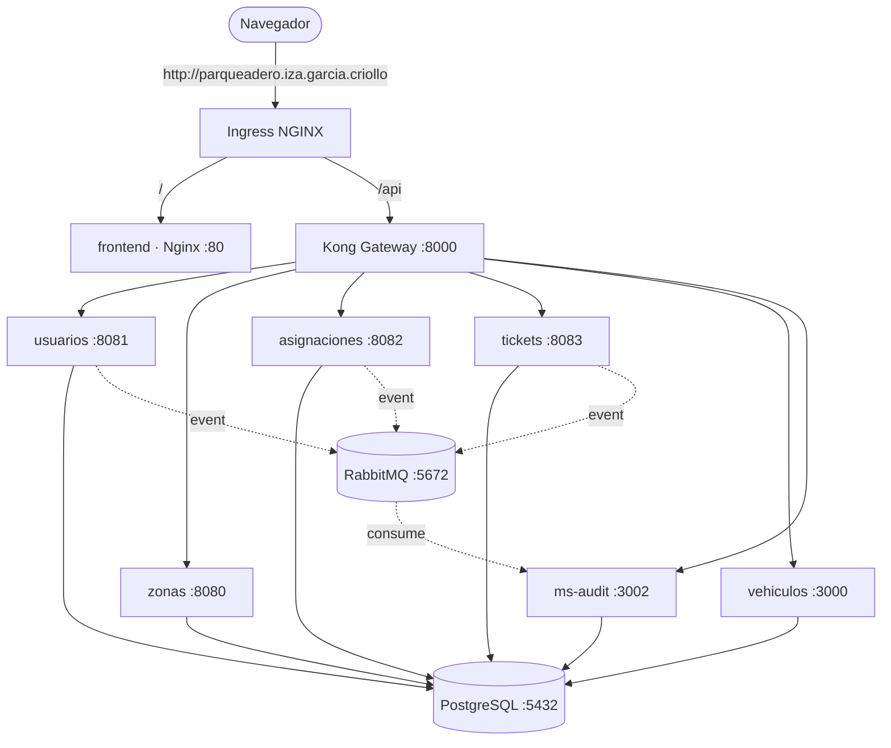

# Despliegue en Kubernetes — Sistema de Gestión de Parqueaderos

Documento técnico del despliegue del sistema completo (6 microservicios + gateway
+ frontend + infraestructura) sobre **Kubernetes (Minikube)**. Explica **qué** se
desplegó, **cómo** y **por qué** se tomó cada decisión de diseño.

- **Namespace:** `parqueadero-iza-garcia-criollo`
- **Host de acceso:** `http://parqueadero.iza.garcia.criollo`
- **Manifiestos:** carpeta [`k8s/`](.)
- **Orquestador del despliegue:** [`k8s/desplegar.sh`](desplegar.sh)

---

## 1. Arquitectura desplegada



**Flujo de una petición:** el navegador entra por un **único host** →
el **Ingress** decide: `/` va al frontend, `/api` va a **Kong** → Kong enruta al
microservicio correspondiente → el microservicio consulta **PostgreSQL** y publica
eventos en **RabbitMQ**, que **ms-audit** consume para la auditoría.

---

## 2. Inventario de componentes

| Componente     | Tipo        | Puerto | Imagen                       | Base de datos |
|----------------|-------------|--------|------------------------------|---------------|
| usuarios       | Spring Boot | 8081   | `parqueadero/usuarios`       | `usuarios`    |
| zonas          | Spring Boot | 8080   | `parqueadero/zonas`          | `zonas`       |
| asignaciones   | Spring Boot | 8082   | `parqueadero/asignaciones`   | `asignaciones`|
| tickets        | Spring Boot | 8083   | `parqueadero/tickets`        | `tickets`     |
| vehiculos      | NestJS      | 3000   | `parqueadero/vehiculos`      | `vehiculos_db`|
| ms-audit       | NestJS      | 3002   | `parqueadero/ms-audit`       | `audit_db`    |
| kong           | Gateway     | 8000   | `kong:3.7` (DB-less)         | —             |
| frontend       | React/Nginx | 80     | `parqueadero/frontend`       | —             |
| postgres       | Base datos  | 5432   | `postgres:16`                | (6 esquemas)  |
| rabbitmq       | Mensajería  | 5672   | `rabbitmq:3-management`      | —             |

---

## 3. Estructura de manifiestos y decisiones de diseño

### 3.1. ¿Por qué **un `.yaml` por servicio** y no varios archivos por servicio?

En la práctica de clase es común separar cada recurso en su propio archivo
(`deployment.yaml`, `service.yaml`, `configmap.yaml`…). Aquí se eligió lo
contrario: **un archivo autocontenido por microservicio**, que agrupa su
`Deployment` **y** su `Service` en el mismo `.yaml` separados por `---`.

**Motivos:**

1. **Cohesión por unidad de despliegue.** Todo lo que define a `usuarios` vive en
   [`10-usuarios.yaml`](10-usuarios.yaml): su Deployment, sus variables de entorno,
   su probe y su Service. Para entender o modificar un servicio se abre **un solo
   archivo**, no tres. Es el principio de "lo que cambia junto, vive junto".
2. **Menos archivos que sincronizar.** 6 microservicios × 2 recursos = 12 archivos
   sueltos frente a 6 archivos cohesivos. Menos ruido, menos posibilidad de aplicar
   un Deployment y olvidar su Service.
3. **YAML multi-documento es idiomático.** Kubernetes soporta varios objetos en un
   archivo con `---`. `kubectl apply -f 10-usuarios.yaml` crea Deployment + Service
   en una sola operación atómica de intención.
4. **Sigue siendo modular.** No es un mega-archivo único con *todo* el sistema
   (eso sería inmanejable y acoplaría el ciclo de vida de recursos independientes).
   El punto medio elegido —**un archivo por servicio**— equilibra granularidad y
   simplicidad.

> **Resumen de la decisión:** ni un mega-`.yaml` global (poco mantenible), ni
> fragmentación extrema por tipo de recurso (mucho archivo suelto). Se agrupa
> **por microservicio**, que es la frontera natural del sistema.

### 3.2. Numeración con prefijos = orden de aplicación

Los archivos se nombran con prefijos numéricos porque **el orden importa**: un
recurso no puede referenciar algo que aún no existe.

| Archivo                              | Contenido                          | Por qué ese orden |
|--------------------------------------|------------------------------------|-------------------|
| [`00-namespace.yaml`](00-namespace.yaml) | Namespace                      | Debe existir **antes** que todo lo demás |
| [`01-configmap-initdb.yaml`](01-configmap-initdb.yaml) | Script SQL de init de BD | Postgres lo monta al arrancar |
| [`02-configmap-kong.yaml`](02-configmap-kong.yaml) | Rutas/plugins de Kong    | Kong lo monta al arrancar |
| [`03-postgres.yaml`](03-postgres.yaml) | PVC + Deployment + Service       | Los microservicios dependen de la BD |
| [`04-rabbitmq.yaml`](04-rabbitmq.yaml) | Deployment + Service             | La mensajería debe estar lista antes |
| `10..15-*.yaml`                      | Los 6 microservicios               | Dependen de BD y RabbitMQ |
| [`20-kong.yaml`](20-kong.yaml)       | Gateway                            | Enruta a los microservicios |
| [`21-frontend.yaml`](21-frontend.yaml) | Frontend                         | Consume la API vía el host |
| [`30-ingress.yaml`](30-ingress.yaml) | Punto de entrada externo           | Último: expone todo lo anterior |

El bloque `10..15` deja "hueco" de numeración a propósito, para poder insertar
nuevos microservicios sin renombrar los demás.

---

## 4. Decisiones clave, una por una

### 4.1. Namespace propio con nombre del equipo
[`00-namespace.yaml`](00-namespace.yaml) aísla **todos** los recursos en
`parqueadero-iza-garcia-criollo`.

- **Por qué:** separa este sistema de otros que corran en el mismo clúster; permite
  borrar todo con un solo `kubectl delete namespace`.
- **Por qué con guiones y no puntos:** un nombre de namespace debe cumplir
  **DNS-1123** (minúsculas, dígitos y guiones; **no** puntos). Por eso el namespace
  usa guiones, mientras que el **host** de navegador sí puede llevar puntos
  (`parqueadero.iza.garcia.criollo`).

### 4.2. Un solo PostgreSQL para las 6 bases
[`03-postgres.yaml`](03-postgres.yaml) despliega **una** instancia `postgres:16`
que aloja los 6 esquemas. El [`ConfigMap` init](01-configmap-initdb.yaml) crea las
bases y usuarios en el primer arranque.

- **Por qué una sola instancia:** en un entorno académico/Minikube, 6 Postgres
  separados desperdiciarían RAM y complicarían el despliegue. Una instancia con
  usuarios/DB por servicio conserva el **aislamiento lógico** (cada micro tiene su
  base y su credencial) sin el coste de 6 contenedores.
- **`strategy: Recreate`:** un `PersistentVolumeClaim` `ReadWriteOnce` **no** admite
  dos pods montándolo a la vez. Con `Recreate`, Kubernetes apaga el pod viejo antes
  de crear el nuevo, evitando el bloqueo del volumen.
- **`PGDATA=/var/lib/postgresql/data/pgdata`:** se usa un subdirectorio para que el
  `initdb` no choque con el punto de montaje raíz del volumen.
- **Persistencia (PVC 2Gi):** los datos **sobreviven** a reinicios de pod y del PC.
  Por eso tras reiniciar no hace falta volver a sembrar.

### 4.3. RabbitMQ para auditoría desacoplada
[`04-rabbitmq.yaml`](04-rabbitmq.yaml) — los microservicios publican eventos y
**ms-audit** los consume de forma asíncrona.

- **Por qué:** la auditoría no debe frenar la operación. Si un servicio emite un
  ticket, no espera a que se escriba la auditoría: publica un evento y sigue. Esto
  **desacopla** el productor del consumidor (patrón de mensajería).

### 4.4. Gateway Kong en modo **DB-less**
[`20-kong.yaml`](20-kong.yaml) + [`02-configmap-kong.yaml`](02-configmap-kong.yaml).

- **Por qué DB-less:** Kong lee toda su configuración (rutas, CORS, JWT) de un
  archivo declarativo montado desde el ConfigMap. **No necesita su propia base de
  datos** → un componente menos que desplegar y mantener.
- **Rol:** punto único de enrutamiento de la API. El frontend habla solo con
  `/api/...` y Kong reparte a cada microservicio por su ruta.

### 4.5. Manejo de claves JWT — el detalle más sutil
Un **único** `Secret` `jwt-keys` (creado por el script desde [`keys/`](../keys))
sirve a dos mundos que consumen la clave de forma distinta:

- **Servicios Spring** (`usuarios`, `zonas`, `asignaciones`, `tickets`): esperan una
  **ruta de archivo**. Se les monta el Secret como **volumen** en `/keys` y se les
  pasa `JWT_PUBLIC_KEY=/keys/jwt_public.pem`. `usuarios` además recibe la clave
  **privada** (`JWT_PRIVATE_KEY`) porque es quien **firma** los tokens.
  Ver [`10-usuarios.yaml`](10-usuarios.yaml).
- **Servicios NestJS** (`vehiculos`, `ms-audit`): esperan el **contenido PEM** en
  una variable de entorno. Se les inyecta con `valueFrom.secretKeyRef`.
  Ver [`15-ms-audit.yaml`](15-ms-audit.yaml).

> **Por qué así:** en vez de duplicar la clave en dos Secrets, **un solo Secret** se
> consume de dos maneras (volumen para Spring, `secretKeyRef` para Nest). Es la misma
> fuente de verdad, adaptada a lo que cada framework sabe leer.

### 4.6. `readinessProbe` con `tcpSocket` y `initialDelaySeconds` alto en Spring
En [`10-usuarios.yaml`](10-usuarios.yaml): `initialDelaySeconds: 40`,
`failureThreshold: 30`.

- **Por qué:** la **JVM de Spring Boot tarda** en arrancar (contexto, Hibernate,
  conexión a BD). Si la probe empezara de inmediato, Kubernetes marcaría el pod como
  "no listo" y podría reiniciarlo en bucle. El retardo inicial y el margen de fallos
  le dan tiempo a arrancar. Los servicios NestJS arrancan más rápido, por eso su
  `initialDelaySeconds` es menor (15).
- **Por qué `tcpSocket` y no HTTP:** basta con comprobar que el puerto acepta
  conexiones; no se depende de un endpoint `/health` concreto en cada servicio.

### 4.7. Imágenes construidas **dentro** del Docker de Minikube
El script hace `eval "$(minikube docker-env)"` antes de `docker build`.

- **Por qué:** así las imágenes quedan disponibles **directamente** en el clúster,
  **sin necesidad de un registry externo** (Docker Hub, etc.). Combinado con
  `imagePullPolicy: IfNotPresent`, Kubernetes usa la imagen local y no intenta
  descargarla de internet.

### 4.8. Variables `VITE_*` del frontend en **build-time**
En [`desplegar.sh`](desplegar.sh) el `docker build` del frontend recibe las URLs de
la API como `--build-arg`.

- **Por qué:** Vite **incrusta** las variables `VITE_*` en el bundle al compilar (no
  se leen en runtime). Por eso la URL del backend (`http://<host>/api/...`) debe
  fijarse al construir la imagen. Si cambia el host, hay que **reconstruir** el
  frontend.

### 4.9. Ingress como **único** punto de entrada
[`30-ingress.yaml`](30-ingress.yaml): un host, dos rutas.

- `/` → `frontend:80`
- `/api` → `kong:8000` (el prefijo `/api` se pasa **tal cual**, sin reescribir, porque
  Kong ya enruta por `/api/v1/...` y `/api/vehiculos`).
- **Por qué un solo host para frontend y API:** al servir todo desde el **mismo
  origen** (`parqueadero.iza.garcia.criollo`) se evitan problemas de **CORS**: el
  navegador ve una sola procedencia.
- `proxy-body-size: 10m`: permite subir cuerpos de petición de hasta 10 MB.

---

## 5. Qué hace el script de despliegue

[`k8s/desplegar.sh`](desplegar.sh) automatiza **todo** el proceso, en orden:

1. **Verifica requisitos** (`docker`, `minikube`, `kubectl`) y que exista un **JDK 25**
   (los servicios Spring lo exigen). Si `JAVA_HOME` apunta a otro JDK, lo corrige.
2. **Genera las claves JWT** si no existen.
3. **Inicia Minikube** (si no corre) y habilita el **addon ingress**.
4. **Apunta Docker al demonio de Minikube** (`minikube docker-env`).
5. **Compila** los 4 JAR de Spring (`./mvnw -DskipTests package`).
6. **Construye las 7 imágenes** (6 microservicios + frontend con `--build-arg`).
7. **Aplica** namespace, ConfigMaps y el Secret `jwt-keys`.
8. **Despliega** Postgres y RabbitMQ y **espera** a que estén listos.
9. **Despliega** microservicios, Kong, frontend e Ingress y espera el *rollout*.
10. *(Opcional)* **Siembra datos** de demo vía `port-forward` a Kong.

Uso:

```bash
./k8s/desplegar.sh            # despliegue completo + datos de demo
./k8s/desplegar.sh --no-seed  # despliegue sin sembrar datos
```

---

## 6. Operación diaria

```bash
# Levantar tras reiniciar el PC
minikube start --driver=docker
kubectl -n parqueadero-iza-garcia-criollo get pods    # esperar a que todos estén 1/1

# Estado general
kubectl -n parqueadero-iza-garcia-criollo get pods,svc,ingress

# Ver logs de un servicio
kubectl -n parqueadero-iza-garcia-criollo logs -f deploy/usuarios

# Dashboard visual
minikube dashboard      # elegir el namespace parqueadero-iza-garcia-criollo

# Detener todo
./k8s/detener.sh
```

**Acceso al sistema** (requiere la entrada en `/etc/hosts`):

```
192.168.49.2   parqueadero.iza.garcia.criollo
```

Frontend: **http://parqueadero.iza.garcia.criollo**

**Cuentas de prueba:** `root/Root2025`, `qa.admin/QaAdmin2025`,
`qa.recauda/QaRecauda2025`, `qa.cliente/QaCliente2025`, `qa.invitado/QaInvitado2025`.

---

## 7. Resumen de decisiones

| Decisión                                   | Alternativa descartada             | Motivo |
|--------------------------------------------|------------------------------------|--------|
| Un `.yaml` por microservicio               | Un archivo por tipo de recurso     | Cohesión: lo que cambia junto, vive junto |
| Prefijos numéricos en los archivos         | Nombres sin orden                  | Garantizar el orden de aplicación (dependencias) |
| Un PostgreSQL con 6 bases                  | 6 instancias de Postgres           | Ahorra recursos; mantiene aislamiento lógico |
| Kong DB-less                               | Kong con base de datos             | Un componente menos que mantener |
| Un solo Secret `jwt-keys` (dos consumos)   | Un Secret por framework            | Una sola fuente de verdad para la clave |
| Imágenes en el Docker de Minikube          | Publicar en un registry externo    | No depende de internet ni credenciales |
| Ingress con un host para frontend + API    | Hosts/orígenes separados           | Evita CORS (mismo origen) |
| `readinessProbe` con retardo alto (Spring) | Probe inmediata                    | La JVM tarda en arrancar |
